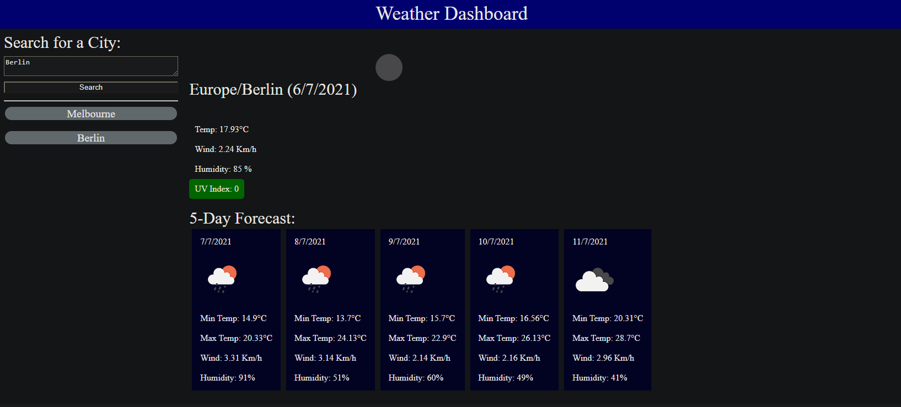

# Weather Dashboard

## Description

A weather dashboard that will run in the browser and feature dynamically updated HTML and CSS.

Utilising Third-party APIs to access data and functionality by making requests with specific parameters to a URL. 

Using the [OpenWeather One Call API](https://openweathermap.org/api/one-call-api) to retrieve weather data for cities. Further utilising `localStorage` to store any persistent data. 

## Installation
Visit the site on github pages at: https://jesse-dejong.github.io/Weather-Dashboard/

## Usage
For the first time looking up a city utilise the search box and search button. Upon which the latitude and longitude will be determined through a separate API call and feed into the weather API, returning the days data and 5 day forecast.

A history function is also available showing the last 10 cities you searched for on that browser, which can be clicked to re-search for that city.

## Credits
Sole collaborator: Me https://github.com/Jesse-DeJong

## License
MIT License

Copyright (c) [2021] [jessedejong]

Permission is hereby granted, free of charge, to any person obtaining a copy
of this software and associated documentation files (the "Software"), to deal
in the Software without restriction, including without limitation the rights
to use, copy, modify, merge, publish, distribute, sublicense, and/or sell
copies of the Software, and to permit persons to whom the Software is
furnished to do so, subject to the following conditions:

The above copyright notice and this permission notice shall be included in all
copies or substantial portions of the Software.

THE SOFTWARE IS PROVIDED "AS IS", WITHOUT WARRANTY OF ANY KIND, EXPRESS OR
IMPLIED, INCLUDING BUT NOT LIMITED TO THE WARRANTIES OF MERCHANTABILITY,
FITNESS FOR A PARTICULAR PURPOSE AND NONINFRINGEMENT. IN NO EVENT SHALL THE
AUTHORS OR COPYRIGHT HOLDERS BE LIABLE FOR ANY CLAIM, DAMAGES OR OTHER
LIABILITY, WHETHER IN AN ACTION OF CONTRACT, TORT OR OTHERWISE, ARISING FROM,
OUT OF OR IN CONNECTION WITH THE SOFTWARE OR THE USE OR OTHER DEALINGS IN THE
SOFTWARE.
---

## Features
- API call to resolve LON/LAT for a given city name
- API call to fetch weather data for the give lon/lat
- History of searched cities that can be clicked to rerun that search
